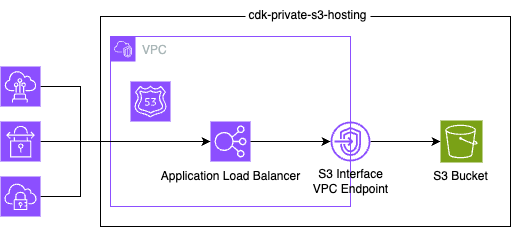

# CDK Private S3 Hosting Construct

This is a CDK construct that creates a private S3 bucket and an Application Load Balancer (ALB) with a listener rule that forwards requests to the S3 bucket.

You can use this construct for a enterprise use case where you want to host a static website in a private network.

Original idea is from [this blog post](https://aws.amazon.com/jp/blogs/networking-and-content-delivery/hosting-internal-https-static-websites-with-alb-s3-and-privatelink/).

[](https://constructs.dev/packages/cdk-private-s3-hosting)
[](https://open.vscode.dev/badmintoncryer/cdk-private-s3-hosting)
[](https://badge.fury.io/js/cdk-private-s3-hosting)
[](https://github.com/badmintoncryer/cdk-private-s3-hosting/actions/workflows/build.yml)
[](https://github.com/badmintoncryer/cdk-private-s3-hosting/actions/workflows/release.yml)
[](https://opensource.org/licenses/Apache-2.0)
[](https://www.npmjs.com/package/cdk-private-s3-hosting)

## Architecture



## Installation

You can install the package via npm:

```sh
npm install cdk-private-s3-hosting
```

## Usage

To create a private S3 bucket and an ALB with a listener rule that forwards requests to the S3 bucket, you can use the following code:

```typescript
import { PrivateS3Hosting } from 'cdk-private-s3-hosting';

const privateS3Hosting = new PrivateS3Hosting(this, 'PrivateS3Hosting', {
  domainName: 'cryer-nao-domain.com',
});
```

After you deploy the stack, you can access the S3 bucket using the ALB's DNS name from the VPC where the stack is deployed.

For example, if you put the `hoge.txt` file in the S3 bucket, you can access it using the following command:

```sh
curl http://cryer-nao-domain.com/hoge.txt
```

### Deploy the frontend assets

You can deploy the frontend assets to the S3 bucket like below:

```typescript
import { PrivateS3Hosting } from 'cdk-private-s3-hosting';
import * as s3deploy from 'aws-cdk-lib/aws-s3-deployment';

const privateS3Hosting = new PrivateS3Hosting(this, 'PrivateS3Hosting', {
  domainName: 'cryer-nao-domain.com',
});

new s3deploy.BucketDeployment(this, 'DeployWebsite', {
  sources: [s3deploy.Source.asset('./website-dist')],
  destinationBucket: websiteBucket,
  bucket: privateS3Hosting.bucket,
});
```

After deploying the stack, you can access the website using the `domainName` you specified from the VPC.

```sh
[cloudshell-user@ip-10-0-31-170 ~]$ curl http://cryer-nao-domain.com/ -L
<!doctype html>
<html lang="en">
  <head>
    <meta charset="UTF-8" />
    <link rel="icon" type="image/svg+xml" href="/vite.svg" />
    <meta name="viewport" content="width=device-width, initial-scale=1.0" />
    <title>Vite + React + TS</title>
    <script type="module" crossorigin src="/assets/index-f40OySzR.js"></script>
    <link rel="stylesheet" crossorigin href="/assets/index-DiwrgTda.css">
  </head>
  <body>
    <div id="root"></div>
  </body>
</html>
```

**Note**: All access to the path pattern `*/` will be redirected to `/index.html`. Therefore, it will function correctly even when the path is set on the frontend and the page is reloaded.

## TLS Certificate

If you want to use HTTPS, you need to create a TLS certificate in ACM and pass it to the `certificate` property.

```typescript
import * as acm from 'aws-cdk-lib/aws-certificatemanager';
import { PrivateS3Hosting } from 'cdk-private-s3-hosting';

declare const certificate: acm.ICertificate;

const privateS3Hosting = new PrivateS3Hosting(this, 'PrivateS3Hosting', {
  domainName: 'cryer-nao-domain.com',
  certificate,
});
```

Of course, specified domain name (`domainName` and `subDomain`) must be the same as the domain name of the certificate.
